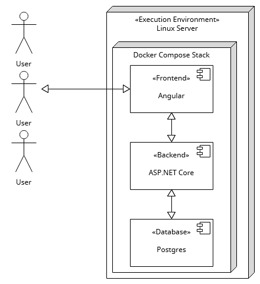

# Project Documentation

## Idea

- User has an account, its credentials are stored in a database, encrypted so backend will not have access to any
  sensitive information in cleartext
- Each user can create, edit and delete their channel/s
- A channel has a name and description which will be shown in the channel overview
- The channel overview is shown upon login to every user
- A user can invite other users to a chatroom using their user id or maybe a unique code/link to join it
- Messages are stored in a database, may be encrypted in some way
- Users can directly message other users, may be encrypted in some way
- Users which a user has directly messaged before are saved and also shown in the channel overview

## Mockups / Wireframes

### Login

### Overview

### Chat Channel

## App Structure

# Log

08.09.2023 - 10.09.2023

- A lot of work on the backend and frontend
- Added a lot of features
- Core functionality is working

30.08.2023

- Add mockups to documentation

25.08.2023

- Basic folder structure
- App structure
- Git repository