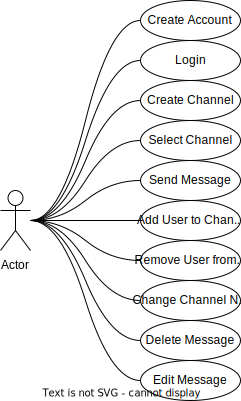

# Project Documentation

## Idea

- User has an account, its credentials are stored in a database, encrypted so backend will not have access to any
  sensitive information in cleartext
- Each user can create, edit and delete their channel/s
- A channel has a name and description which will be shown in the channel overview
- The channel overview is shown upon login to every user
- A user can invite other users to a chatroom using their user id or maybe a unique code/link to join it
- Messages are stored in a database, may be encrypted in some way
- Users can directly message other users, may be encrypted in some way
- Users which a user has directly messaged before are saved and also shown in the channel overview

## Usecase Diagram

## Use Cases

### Create Account

- **Actor**: User
- **Description**: A user creates an account
- **Preconditions**: User is not logged in
- **Postconditions**: User is logged in
- **Normal Flow**:
    1. User enters username and password
    2. User clicks on "Register"
    3. User is redirected to the login page
- **Alternative Flow**:
    1. User enters username and password
    2. User clicks on "Register"
    3. Username is already taken
    4. User is notified that the username is already taken
    5. User enters a different username
    6. User clicks on "Register"
    7. User is redirected to the login page

### Login

- **Actor**: User
- **Description**: A user logs in
- **Preconditions**: User is not logged in
- **Postconditions**: User is logged in
- **Normal Flow**:
    1. User enters username and password
    2. User clicks on "Login"
    3. User is redirected to the channel overview
    4. User can now use the chat
- **Alternative Flow**:
    1. User enters username and password
    2. User clicks on "Login"
    3. Username or password is incorrect
    4. User is notified that the username or password is incorrect
    5. User enters a different username or password
    6. User clicks on "Login"
    7. User is redirected to the channel overview
    8. User can now use the chat

### Create Channel

- **Actor**: User
- **Description**: A user creates a channel
- **Preconditions**: User is logged in
- **Postconditions**: Channel is created
- **Normal Flow**:
    1. User clicks on "Create Channel"
    2. User enters channel name and description
    3. User clicks on "Create"
    4. User is redirected to the channel overview
    5. Channel is shown in the channel overview
- **Alternative Flow**:
    1. User clicks on "Create Channel"
    2. User enters channel name and description
    3. User clicks on "Create"
    4. Channel name is already taken
    5. User is notified that the channel name is already taken
    6. User enters a different channel name
    7. User clicks on "Create"
    8. User is redirected to the channel overview
    9. Channel is shown in the channel overview

### Select Channel

- **Actor**: User
- **Description**: A user selects a channel
- **Preconditions**: User is logged in
- **Postconditions**: Channel is selected
- **Normal Flow**:
    1. User clicks on a channel in the channel overview
    2. User is redirected to the channel
    3. User can now use the chat

### Send Message

- **Actor**: User
- **Description**: A user sends a message
- **Preconditions**: User is logged in and a channel is selected
- **Postconditions**: Message is sent
- **Normal Flow**:
    1. User enters a message
    2. User clicks on "Send"
    3. Message is sent
    4. Message is shown in the chat
- **Alternative Flow**:
    1. User enters a message
    2. User clicks on "Send"
    3. Message is not sent
    4. User is notified that the message could not be sent
    5. User tries to send the message again
    6. User clicks on "Send"
    7. Message is sent
    8. Message is shown in the chat

### Add User to Channel

- **Actor**: User
- **Description**: A user adds another user to a channel
- **Preconditions**: User is logged in and a channel is selected and the user is the owner of the channel
- **Postconditions**: User is added to the channel
- **Normal Flow**:
    1. User clicks on "Add User"
    2. User enters the username of the user to add
    3. User clicks on "Add"
    4. User is added to the channel
    5. User is notified that the user was added to the channel
    6. Channel is shown in the channel overview for the user that was added
- **Alternative Flow**:
    1. User clicks on "Add User"
    2. User enters the username of the user to add
    3. User clicks on "Add"
    4. Username is not found
    5. User is notified that the username was not found
    6. User enters a different username
    7. User clicks on "Add"
    8. User is added to the channel
    9. User is notified that the user was added to the channel
    10. Channel is shown in the channel overview for the user that was added

### Remove User from Channel

- **Actor**: User
- **Description**: A user removes another user from a channel
- **Preconditions**: User is logged in and a channel is selected and the user is the owner of the channel
- **Postconditions**: User is removed from the channel
- **Normal Flow**:
    1. User clicks on "Remove User"
    2. User enters the username of the user to remove
    3. User clicks on "Remove"
    4. User is removed from the channel
    5. User is notified that the user was removed from the channel
    6. Channel is not shown in the channel overview for the user that was removed

### Change Channel Name

- **Actor**: User
- **Description**: A user changes the name of a channel
- **Preconditions**: User is logged in and a channel is selected and the user is the owner of the channel
- **Postconditions**: Channel name is changed
- **Normal Flow**:
    1. User clicks on the Channel name
    2. User enters the new channel name
    3. User clicks on "Change"
    4. Channel name is changed
    5. User is notified that the channel name was changed
    6. Channel is shown in the channel overview with the new channel name
- **Alternative Flow**:
    1. User clicks on the Channel name
    2. User enters the new channel name
    3. User clicks on "Change"
    4. Channel name is already taken
    5. User is notified that the channel name is already taken
    6. User enters a different channel name
    7. User clicks on "Change"
    8. Channel name is changed
    9. User is notified that the channel name was changed
    10. Channel is shown in the channel overview with the new channel name

### Delete Message

- **Actor**: User
- **Description**: A user deletes a message
- **Preconditions**: User is logged in and a channel is selected and the user is the sender of the message
- **Postconditions**: Message is deleted
- **Normal Flow**:
    1. User clicks on the message
    2. User clicks on "Delete"
    3. Message is deleted
    4. User is notified that the message was deleted
    5. Message is not shown in the chat anymore
- **Alternative Flow**:
    1. User clicks on the message
    2. User clicks on "Delete"
    3. Message is not deleted
    4. User is notified that the message could not be deleted
    5. User tries to delete the message again
    6. User clicks on "Delete"
    7. Message is deleted
    8. User is notified that the message was deleted
    9. Message is not shown in the chat anymore

### Edit Message

- **Actor**: User
- **Description**: A user edits a message
- **Preconditions**: User is logged in and a channel is selected and the user is the sender of the message
- **Postconditions**: Message is edited
- **Normal Flow**:
    1. User clicks on the message
    2. User enters the new message
    3. User clicks on "Edit"
    4. Message is edited
    5. User is notified that the message was edited
    6. Message is shown in the chat with the new message

## BPMN Diagram

## Mockups / Wireframes

### Login

### Overview

### Chat Channel

## App Structure

# Log

08.09.2023 - 10.09.2023

- A lot of work on the backend and frontend
- Added a lot of features
- Core functionality is working

30.08.2023

- Add mockups to documentation

25.08.2023

- Basic folder structure
- App structure
- Git repository